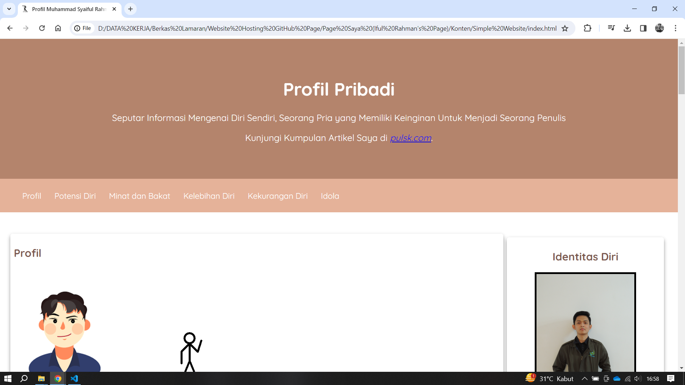

## Simple Website (Testing)

  

## Technology
- HTML
- CSS

## How to use it :
1. Download the folder from this repository
2. Open and click on index.html, then open it using a browser.

<i>OR</i>

- Click the following link to visit online: [Simple Website](https://ifulrahman.github.io/ifulrahmanSimpleWeb.github.io/)
